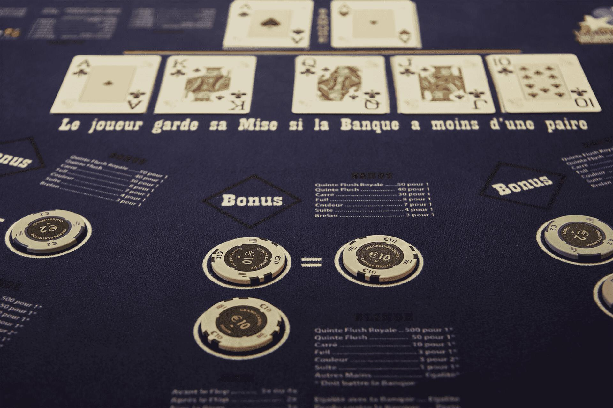
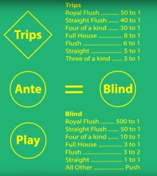
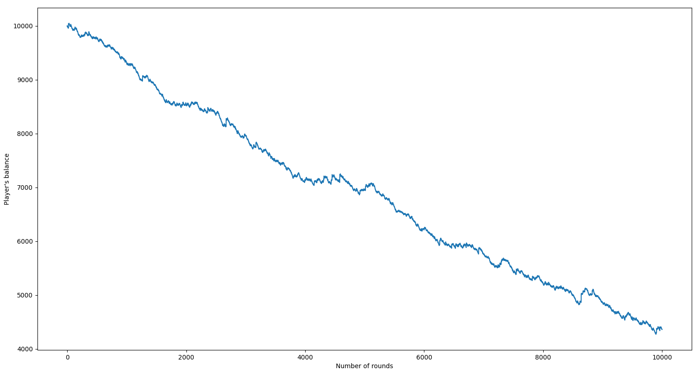

# Studying long term gains of the Poker Ultimate game

*Made by Gabriel Astieres, for any questions [contact me](mailto:gabriel.astieres@gmail.com)*

## The rules

This project focuses on the Poker Ultimate game, where players don't compete between themselves but against the dealer. Players must beat the dealer's hand to win the round, the hands evaluation & strenght following classic Texas hold'em poker.

In order for a player to play, the same amount of money must be deposited on the `Ante` & on the `Blind`. In addition, an optional side bet, can be deposited on the `Trips`, which would be winning if the player's hand turned out to be a three-of-a-kind or better.

The betting mechanism is specific to this game. There are 3 opportunities to bet, either `pre flop`, `post flop` or on the `River` for respectively, 4 (or 3), 2 and 1 times the amound deposited on the `Ante`.

If the player wins the round, the bank will pay him the amount he played & the amount of the `Ante`. Concerning the payout of `Blinds` please refer to the following illustration. On the other hand, if he loses, the entire amount bet on this round is lost.

The `Trips` are paid regardless of the outcome of the round and are lost in the same way if the player doesn't have a hand justifying a prize. 

## What is included in this repo?

This projects aims to simulate a large number of Poker Ultimate rounds to see the returns of a strategy. The hands are randomly distributed to the dealer and player, evaluated to determine the winner and find the combination made. The setup and iteration is made in the main function of `UltimatePoker.py` and rely on the different files for the payout, comparison & strategy.

## How to implement a strategy?

In order to implement a betting strategy, head to the `playerStrategy.py` file. By choosing how the player bets via `getBetSize` you will be able to test over time the return of this strategy. Running `UltimatePoker.py` will give you the player's balance variation over the number of rounds. 

Here is the variation over 10k rounds with the trivial strategy implemented in this public version?

This tool has been made for fun & also to be able to test the returns over time of various behavior. Feel free to play around and test various ideas.

